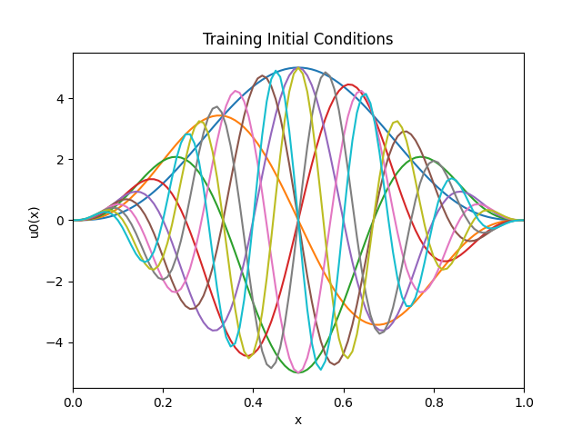
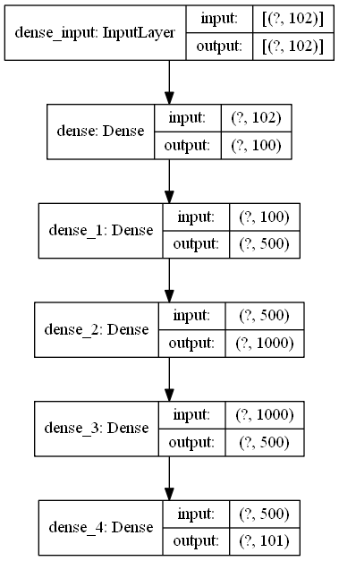
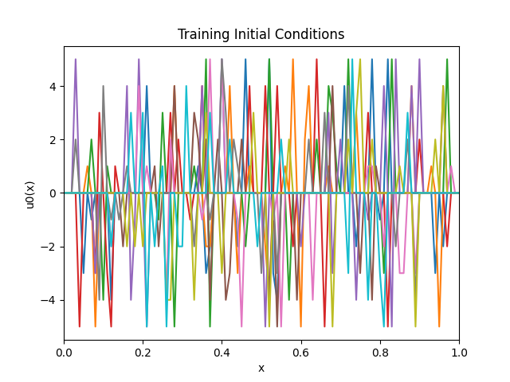
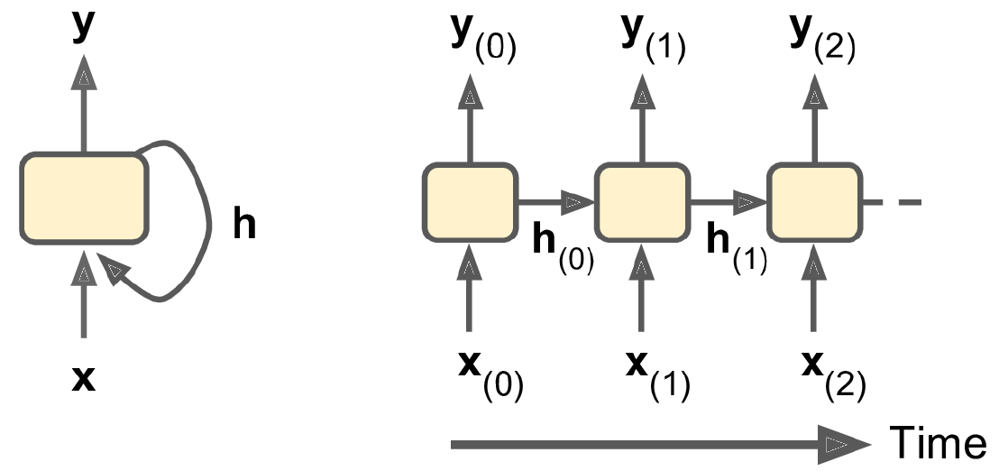
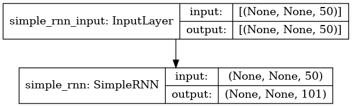
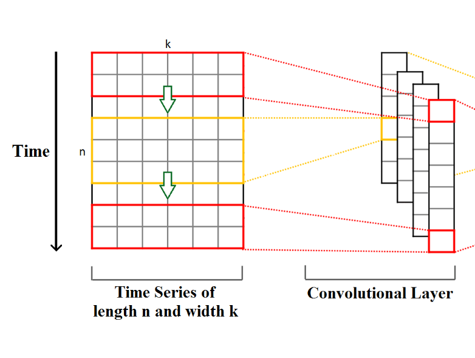
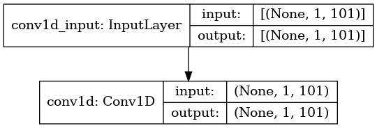

# Optimal Estimation using Neural-Networks and Shape Optimization
This repository contains codes and reuslts for optimal estimation of heat equation by means of shape optimization and neural networks. Consider a one-dimensional steal bar over the interval . Let  be the temperature of the bar at location  and time . The changes in the temperature is governed by the equation:


<p align="center"></p>


## Forward simulation
Forward simulation involves a function that gives the output to the model given the inputs. For our specific example, the inputs are an initial temperature profile  and a sensor shape set . The output  is the temperature measured by a sensor in the set ; that is, . 

 There are various methods to solve the heat equation and find the solution  for every initial condition. We use forward-time central-space finite-difference discretization method to find the solution of the heat equation. The following Python function is created that yields the solution


```python
u = FTCS(dt,dx,t_max,x_max,k,u0)
```


The parameters of the function are defined below.

|Time increment: |Space discretization: |Final time: |Length of the bar: |conductivity: |
|:------------------:|:-----------------------:|:--------------:|:------------------------:|:--------------:|
|         0.1       |            0.01         |       100       |            1            |      0.0003     |

For the specified parameters and the following initial condition , the solution is obtained by running the code

```cmd
>> .\forward_sim.py
```
The output for these parameters is 

<p align="center">

</p>

## Neural-Network Estimator
A neural-network estimator is trained from some set of initial conditions to estimate the solution of the heat equation for any arbitrary initial condition. The set of initial conditions selected for training is

<p align="center"></p>

where  is changed from `1` to `N` to create new training sample. 

Training data are stored in `input.npy`. The input is an array with the shape `(m,c+1)` where `m=N*r` is the number of training data. In each column, an initial condition is followed by a number indicating a time at which the output is calculated.  The output is an array stored in `output.npy`. Let `u` be the solution to the heat equation with initial condition `u0` at time `t[s]`.

```python
input = zeros((m,c+1))
output = zeros((m,c))

def IC(x,omega,u_max):
    u = 16*u_max*(x**2)*((x-1)**2)*sin(omega*pi*x)
    return u

n=0
for omega in range(1,N+1):
    u0 = array([IC(x,omega,u_max) for x in X])
    u = FTCS(dt, dx, t_max, x_max, k, u0)
    for s in range(0,r):
        input[n,0:c] = u0
        input[n,c] = t[s] 
        output[n,:] = u[s,:]
        n = n+1
```
The training inputs are illustrated in the following figure.
<p align="center">

</p>

We use a sequential model in Keras library of TensorFlow to build an estimator. The estimator is indicated by `model` and is consitruced in four steps as follows. 

### 1. Defining the Layers
First, a sequential model is defined using the comand `tensorflow.keras.Sequential`. Layers are added afterwards one by one using the command `model.add`. Three layers are often present: Input Layer, Dense Layer, Output Layer. 

```python
model = Sequential()
model.add(Dense(100, input_dim = c1, activation='selu'))
model.add(Dense(500, activation='selu'))
model.add(Dense(1000, activation='selu'))
model.add(Dense(500, activation='selu'))
model.add(Dense(c, activation='selu'))
```
The architecture of the model is as follows

<p align="center">

</p>

### 2. Choosing the Comipiler
Optimization method, loss function, and performance metrics are chosen in this step.
```python
model.compile(optimizer='adam', loss='mean_squared_error', metrics=['accuracy'])
```

### 3. Training the Model
Sample data are fed to the model to train it. The data are divided into epochs and each spoch is further divided into batches.

```python
model.fit(input, output, epochs=1, batch_size=m)
```


### 4. Evaluating the Performance
We use some test data to evaluate the performance of the trained model. This includes feeding some sample input and output to the model and calculate the loss and performance metric.

```python
eval_result = model.evaluate(u0, u_real.reshape((1,c,r)), batch_size=1)
print('evaluation result, [loss, accuracy]=' , eval_result)
```

## Estimation (i.e. Making Predictions)
For the time being, we assume  and . Estimation is

```python
u_pred=model.predict(np.asarray(u0).reshape((1,c)), batch_size=1)
```

### Choice of activation function
An activation function can be chosen in each layer. An activation function should reflect the original mathematical model. In what follows, we will compare the following activation functions.

|`elu`|`tanh`|`relu`|
|-----|------|------|
||||

### Choice of optimizer
The activation function is fixed to `selu`.

|`Adadelta`|`SGD`|`RMSprop`|
|-----|------|------|
||||

### Choice of loss function
The activation function and optimizer are fixed to `selu` and `Adam`, respectively.

|`mean_squared_error`|`huber_loss`|`mean_squared_logarithmic_error`|
|-----|------|------|
||||

### Changing Initial Conditions 
For the activation function `selu`, optimizer `Adam`, loss function `huber_loss`, different initial conditions are tested to observe the performance of the estimator.

||||
|-----|------|------|
||||

### Random Training Data
We also use random initial conditions to train the model. The random training data includes initial conditions generated with the following code

```python
# Random Initial Conditions
from random import sample, choices
m = N*r    # number of input data
input = zeros((m,c+1))
output = zeros((m,c))

m = int(x_max/dx/5)
n = 0
for itr in range(0,N):
    rand_location = sample(range(2,c-2), k = m)
    rand_temperature = choices(list(chain(range(-u_max, 0), range(1, u_max+1))), k = m)

    u0 = zeros(c+1)
    for i in range(0,m):
        u0[rand_location[i]] = rand_temperature[i]

    plt.plot(X, u0[0:c])
    u = FTCS(dt, dx, t_max, x_max, k, u0[0:c])
    for s in range(0,r):
        u0[c] = t[s]
        input[n,:] = u0
        output[n,:] = u[s,:]
        n = n+1
```
These initial conditions are depicted in the next figure

<p align="center">

</p>

The response of the model trained with random initial conditions are shown in the next table

||||
|-----|------|------|
||||

## RNN Layer
An RNN layer is a recurrent neural network in which the output is fed back to the network. A schematic of the network is depicted below

|  RNN schematic | current architecture|
|----------------|---------------------|
|||

To add a recurrent layer to a sequential model in keras, the layer `SimpleRNN` is used.

```python
model = Sequential([
    SimpleRNN(c, activation=act_function, return_sequences=True, input_shape=[None, cl])
    ])
```

The following is the simulation result for an RNN predictor


## CNN Layer
A CNN layer applies various filters to a time series and yields a time series width shorter with depending on the size of its filter. A schematic of the network is depicted below

|  CNN schematic | current architecture|
|----------------|---------------------|
|||

To add a 1D convolutional layer to a sequential model in keras, `Conv1D` is used as follows
```python
model = Sequential([
    Conv1D(filters=c, activation=act_function, kernel_size=cl,
     strides=1, padding="same", input_shape=(1, cl))
     ])
```
The following is the simulation result for a CNN predictor


## Shape Optimization
In this section, the input to the estimator will only be an initial condition over a subset  