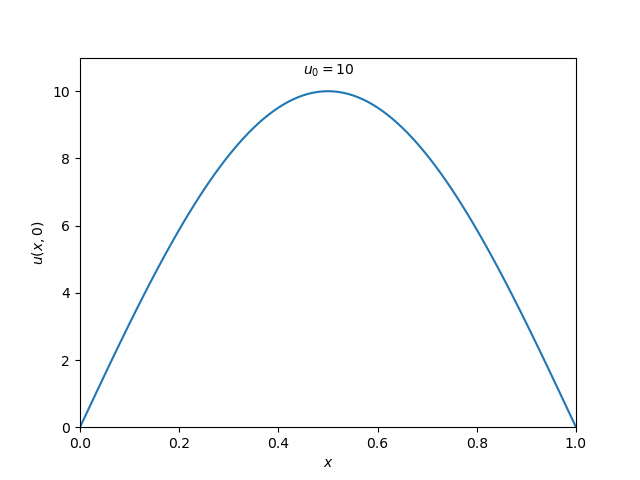
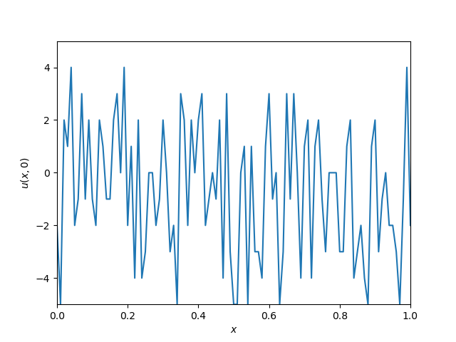
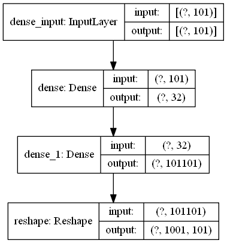

# Optimal Estimation Using Neural Network
Consider a one-dimensional steal bar over the interval $[0,\ell]$. Let $u(x,t)$ be the temperature of the bar at location $x\in [0,1]$ and time $t$. The changes in the temperature is governed by the equation:


\begin{equation*}
\begin{cases}
u_{t}(x,t)=ku_{xx}(x,t),\\
u_x(0,t)=u_x(\ell,t)=0.
\end{cases}
\end{equation*}


The initial temperature is as follows:
\begin{equation*}
u(x,0)=u_0\sin (\pi x).
\end{equation*}

## Forward simulation
A specific initial temperature profile is chosen to run the forward simulation. That is,

<p align="center">

</p>

Consider the following parameteres

|Time increment $dt$|Space discretization $dx$|Final time $t_{max}$|Length of the bar $x_{max}=\ell$|conductivity $k$|Max temperature $u_0$|
|:------------------:|:-----------------------:|:--------------:|:------------------------:|:--------------:|:-----------------:|
|         0.1       |            0.01         |       100       |            1            |      0.0003     |         5        |

The following function yields solution to the heat equation.

```python
x,u,r,s = FTCS(dt,dx,t_max,x_max,k,u0)
```

Runing the following code solve the equaation.

```
> py forward_sim.py
```

The changes in the temperature is according to

<p align="center">

</p>

## Neural-network estimator
Let the output $y(x,t)$ indicate the temperature measured by a sensor in the interval $[x_1,x_2]$. A set of random initial conditions is fed to the forward simulations to generate the training data. For the time being, we assume $x_1=0$ and $x_2=1$. A sample initial conditions for the training is as follows:

<p align="center">

</p>


The system response to this training sample is as follows and will be collocted.

<p align="center">

</p>

The diagram of the neural-netwrok estimator is shown below

<p align="center">

</p>
