# Optimal Estimator Desgin
This repository contains codes and results for optimal estimation of heat equation by means of shape optimization and neural networks. 

Consider a one-dimensional heat-conductive bar over the interval $[0,\ell]$. Let $u(x,t)$ be the temperature of the bar at location $x\in [0,1]$ and time $t>0$. The changes in the temperature is governed by the equation:


\begin{equation}
\begin{cases}
u_{t}(x,t)=ku_{xx}(x,t),\\
u_x(0,t)=u_x(\ell,t)=0,\\
u(x,0)=u_0(x).
\end{cases}
\end{equation}


## Forward simulation
Forward simulation involves a function that gives the output to the model given the inputs. For our specific example, the inputs are an initial temperature profile $u(x,0)$ and a sensor shape set $\omega\subset [0,1]$. The output $y(x,t)$ is the temperature measured by a sensor in the set $\omega$; that is, $y(x,t)=\chi_\omega u(x,t)$. 

 There are various methods to solve the heat equation and find the solution $u(x,t)$ for every initial condition. We use forward-time central-space finite-difference discretization method to find the solution of the heat equation. The following Python function is created that yields the solution


```python
u = FTCS(dt,dx,t_max,x_max,k,u0)
```


The parameters of the function are defined below.

|Time increment: $dt$|Space discretization: $dx$|Final time: $t_{max}$|Length of the bar: $x_{max}=\ell$|conductivity: $k$|
|:------------------:|:-----------------------:|:--------------:|:------------------------:|:--------------:|
|         0.1       |            0.01         |       100       |            1            |      0.0003     |

For the specified parameters and the following initial condition $u(x,0)=u_0\sin (\pi x)$, the solution is obtained by running the code

```cmd
>> .\forward_sim.py
```

## Neural-Network Estimator
A neural-network estimator is trained from some set of initial conditions to estimate the solution of the heat equation for any arbitrary initial condition. The set of initial conditions selected for training is

\begin{equation}
u_0(x)=16x^2(x-1)^2\sin(\pi\omega x)
\end{equation}

where $\omega$ is changed from `1` to `N` to create new training sample. The training inputs are illustrated in the following figure.
<p align="center">

</p>

Use the function `generate_data()` to create training data. Training data are also stored in the external files `input.npy` and `output.npy`. 


## Building a model
We build a model using `keras` library of `tensorFlow`. The estimator is indicated by `model` and is consitruced in steps as follows. 

### 1. Choosing Layers 
#### Sequential Layer
A sequential layer is defined using the comand `tensorflow.keras.Sequential`. Layers are added one by one using the command `model.add`. Three layers are often present: Input Layer, Dense Layer, Output Layer. 

```python
model = Sequential()
model.add(Dense(100, input_dim = c1, activation='selu'))
model.add(Dense(500, activation='selu'))
model.add(Dense(1000, activation='selu'))
model.add(Dense(500, activation='selu'))
model.add(Dense(c, activation='selu'))
```
The architecture of this model is as follows

<p align="center">

</p>

#### RNN Layer
An RNN layer is a recurrent neural network in which the output is fed back to the network. A schematic of the network is depicted below

|  RNN schematic | current architecture|
|----------------|---------------------|
|||

To add a recurrent layer to a sequential model in keras, the layer `SimpleRNN` is used.

```python
model = Sequential([
    SimpleRNN(c, activation=act_function, return_sequences=True, input_shape=[None, cl])
    ])
```

The following is the simulation result for an RNN predictor


#### CNN Layer
A CNN layer applies various filters to a time series and yields a time series width shorter with depending on the size of its filter. A schematic of the network is depicted below

|  CNN schematic | current architecture|
|----------------|---------------------|
|||

To add a 1D convolutional layer to a sequential model in keras, `Conv1D` is used as follows
```python
model = Sequential([
    Conv1D(filters=c, activation=act_function, kernel_size=cl,
     strides=1, padding="same", input_shape=(1, cl))
     ])
```
The following is the simulation result for a CNN predictor

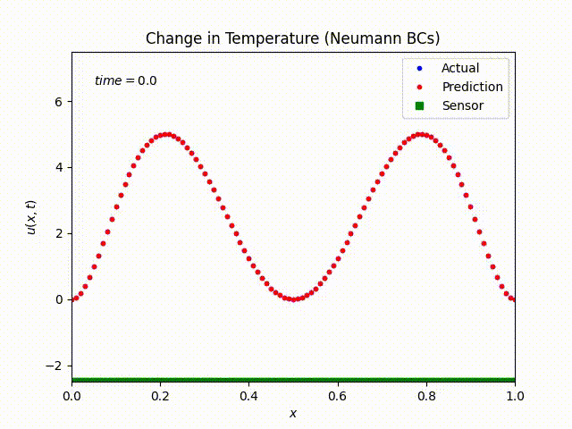


### 2. Choosing the Compiler
Optimization method, loss function, and performance metrics are chosen in this step.
```python
model.compile(optimizer='adam', loss='mean_squared_error', metrics=['accuracy'])
```

### 3. Training the Model
Sample data are fed to the model to train it. The data are divided into epochs and each epoch is further divided into batches.

```python
model.fit(input, output, epochs=1, batch_size=m)
```

### 4. Evaluating the Performance
We use some test data to evaluate the performance of the trained model. This includes feeding some sample input and output to the model and calculate the loss and performance metric.

```python
eval_result = model.evaluate(u0, u_real.reshape((1,c,r)), batch_size=1)
print('evaluation result, [loss, accuracy]=' , eval_result)
```

### 5. Estimation (i.e. Making Predictions)
For the time being, we assume $x_1=0$ and $x_2=1$. Estimation is

```python
u_pred=model.predict(np.asarray(u0).reshape((1,c)), batch_size=1)
```

An activation function can be chosen in each layer. An activation function should reflect the original mathematical model. Optimizer and loss fuctions are to be chosen as well.

Different initial conditions are tested to observe the performance of the estimator. We have cosidered the follwing initial conditions:

\begin{equation}
\begin{cases}
u_0(x)=x^2(x-1)^2(x-\frac{1}{2})^2\\
u_0(x)=x^2(x-1)^2(x+\frac{1}{2})^2\\
u_0(x)=x^2(x-1)^2(x-\frac{1}{4})^2\\
\lbrace 0, 0\le x \le 0.5, 1, 0.5 < x\le 1\rbrace
\end{cases}
\end{equation}

## Shape Optimization
Let $\omega \subset [0,1]$ indicate the sensor shape, and $u_r$ be the real solution to the heat equation and $u_p$ be the prediction. Consider the following linear-quadratic cost function:

\begin{equation}
J(\omega) = \alpha|\omega|+ \int_0^\tau \int_0^1 (u_p(x,t;\omega)-u_r(x,t))^2 dx dt.
\end{eqaution}

Remember that a neural-network estimator is a nonlinear map that maps the solution at each time snap to the next time snap:

\begin{equation}
u_p(x,t_{n+1};\omega) = f_{\omega}(\chi_\omega(x)u_r(x,t_n)),
\end{equation}

where $\chi_{\omega}(x)$ is a characteristic function indicating the sensor region. 

The derivative of $J(\omega)$ with respect to $\omega$ is

\begin{equation}
J'(\omega) = \alpha+ 2 \int_0^\tau \int_0^1 u'_p(x,t;\omega)(u_p(x,t;\omega)-u_r(x,t)) dx dt.
\end{equation}

The function $u'_p(x,t;\omega)$ is the derivative of $u_p(x,t;\omega)$ with respect parameter $\omega$. This derivative is

\begin{equation}
u'_p(x,t_{n+1};\omega) = \chi'_\omega(x)f'_{\omega}(\chi_\omega u_r(x,t_n))+df_{\omega}(\chi_\omega u_r(x,t_n))
\end{equation}

The function $f'_{\omega}(\cdot)$ is the gradient of the network with respect to its input, and $df_{\omega}(\cdot)$ is the gradient of the network with respect to sensor locations. Also, the function $\chi'_{\omega}(x)$ is the derivative of $\chi_\omega(x)$ with respect to sensor location $\omega$. As a result, the gradient of the cost function with respect to sensor location is 

\begin{equation}
J'(\omega) = \alpha + 2 \int_0^{\tau} \int_0^1  \left(\chi'_\omega(x)f'(\chi_\omega(x) u_r(x,t))+df_{\omega}(\chi_\omega u_r(x,t_n))\right)(u_p(x,t;\omega)-u_r(x,t)) dx dt.
\end{equation}

We are interested in the discrete implementation of sensor shape optimization. In this implementation, we interpret $\omega$ as a vector with as many entries as the vector $x$. Each entry is the probability of sensor presence at each node. As an example, $\omega = [0.5,0.1,...,1]$ shows that the probability of sensor presence at the first node is 0.5, at the second node is 0.1, and so on. The characteristic function $\chi_{\omega}(x)$ is then the `diag` operation on `omega`. So, the term $\chi_\omega(x)u_r(x,t_n)$ is replaced with the matrix multiplication `diag(omega)*u_real`. Also, the derivative $\chi'_{\omega}(x)$ is the derivative with respect to each probability of sensor presence. For instance, the derivative with respect to probability of sensor at node 1 is `diag([1,0,0,...,0])`.  It is assumed that the gradient of the newrok with respect to omega is negligible.

### shape_optimizer.py
Use the python function `LQ_cost(u_pred,model,omega)` to calculate the cost.

```python
def LQ_cost(omega):

    omega_ = [i for i, value in enumerate(omega) if value < 0.5]

    input = array(training_data[0])
    input[:,omega_] = 0
    output = array(training_data[1])

    model.fit(input, output, batch_size=1000, epochs=4,verbose=0)

    u_pred = model.predict(matmul(u_real,diag(omega)))
    cost = (u_pred - u_real)**2
    cost = trapz(trapz(cost, dx=dx), dx=dt) 
    cost += 350*sum(omega) #(c-len(omega_))
    
    return cost
```

Keras uses the method `keras.backend.gradients` for calculating the gradient.  Use the python function `LQ_grad(omega)` to calculate the gradient

```python
def LQ_grad(omega):

    u_pred = model.predict(matmul(u_real,diag(omega)))

    grads = K.gradients(model.output, model.input)[0]
    gradient = K.function(model.input, grads)
    g = gradient(matmul(u_real,diag(omega)))

    D = 2*g*(u_pred-u_real)
     
    grad = zeros(c)
    for i in range(0,c):
        int = D[:,i]
        grad[i] = trapz(int, dx=dt) + 350
    
    return grad
```

The optimal actuator shape is then obtained by running the code

```python
res = minimize(LQ_cost,omega_0,method='trust-constr',
           jac=LQ_grad,
           bounds=bounds,
           options={'verbose': 1, 'maxiter': 100, 'disp': True},
           callback=callback_cost)
```

Use the function `animate(u_real,model,omega,FileName)` to illustrate the performance of the estimator and save the result.


|  Time evolution for optimal sensor arrangement | Cost vs iterations |
|----------------|---------------------|
|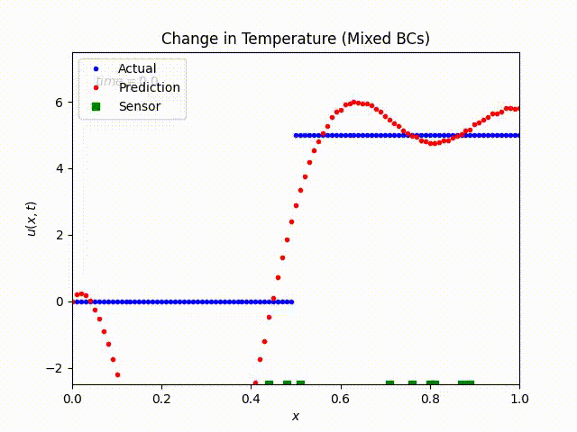|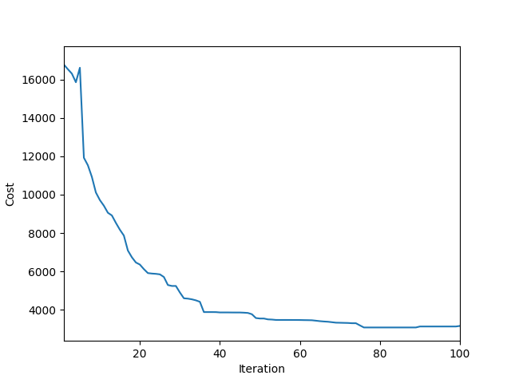|
|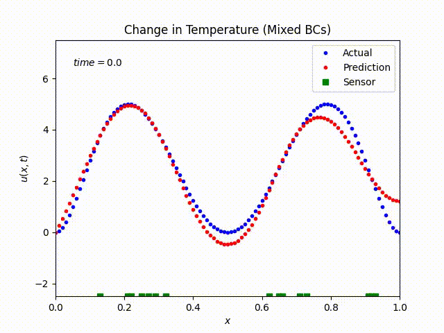|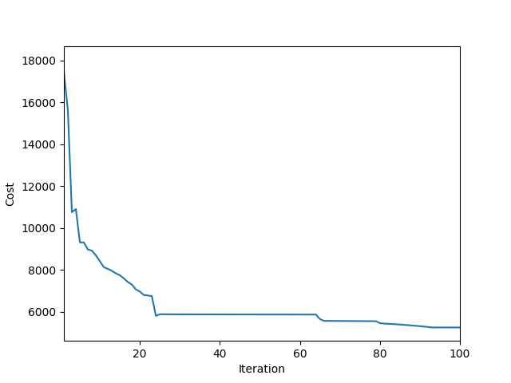|
|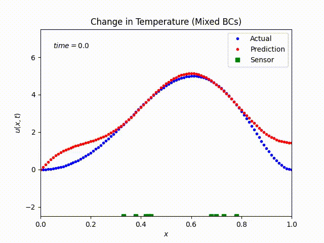|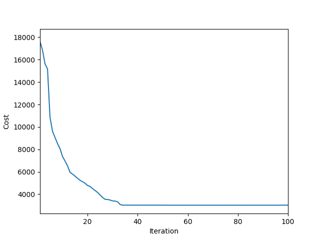|
|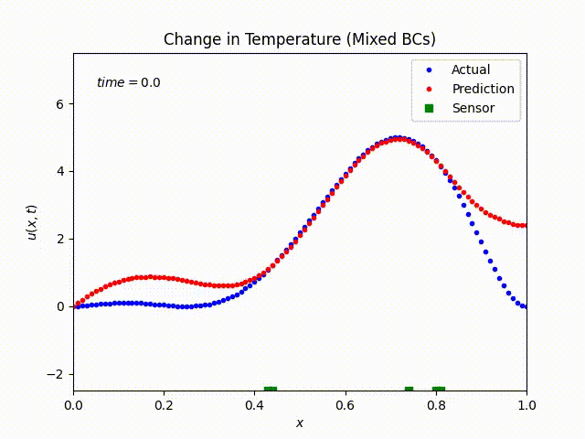|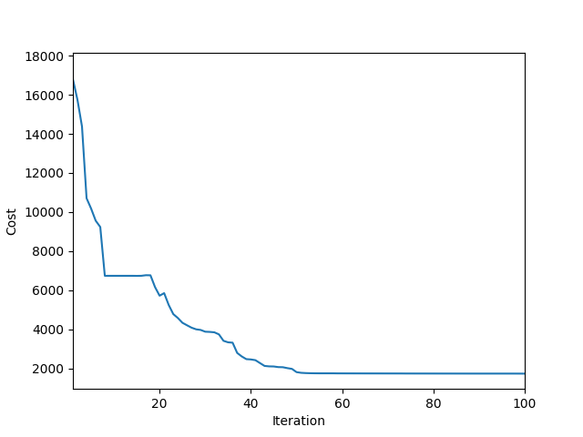|


|  Time evolution when $\alpha=50$ | Time evolution when $\alpha=500$ |
|----------------|---------------------|
|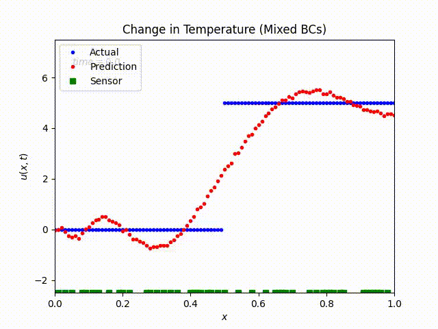|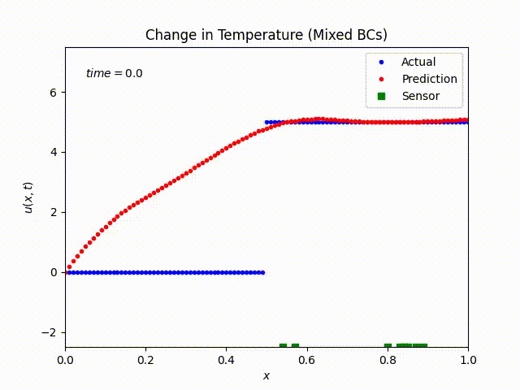|

|  Time evolution when $\omega_0$ is random | Time evolution when $\omega_0$ is zero array|
|----------------|---------------------|
|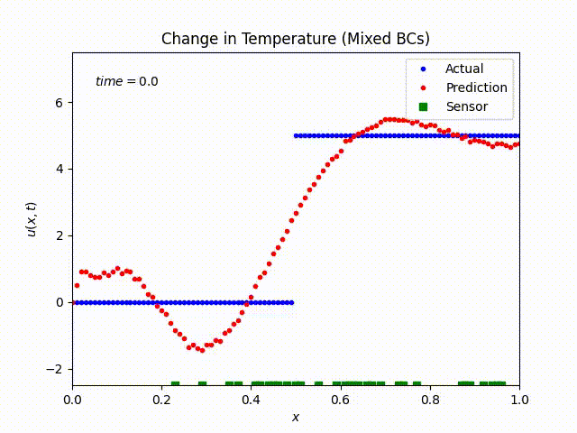||